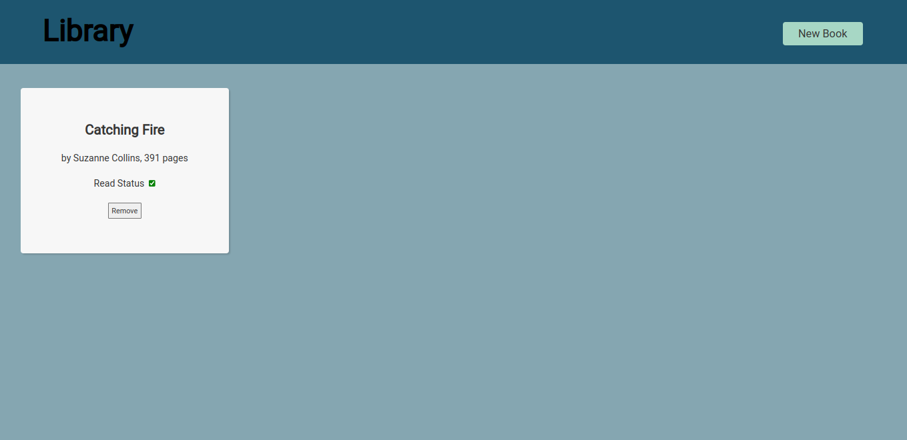

# Library

> Create a simple library web application.
> Live demo [_here_](https://nabelk.github.io/library/).

## Table of Contents

-   [General Info](#general-information)
-   [Technologies Used](#technologies-used)
-   [Tools](#tools)
-   [Features](#features)
-   [Screenshots](#screenshots)
-   [Room for Improvement](#room-for-improvement)
-   [Contact](#contact)

## General Information

-   The project is a part of The Odin Project: Full Stack JavaScript.
-   It can add book list and can update the read status.
-   The main purpose of the project is to get understanding on object constructor and prototype.

## Technologies Used

-   HTML
-   CSS
-   Javascript
        a) Changes on the display also get updated on the object.
        b) Heavy DOM usage to manipulate the display using vanilla js.

## Tools

-   Prettier && eslint
        For finding erros and formatting on save (vscode).

## Features

-   Responsive design (web, tablet & mobile)

## Screenshots

## Room for Improvement

Room for improvement:

-   Information on book card has a feature to edit.
-   Make a local storage at least for the application.

## Contact

Created by [@nabelk](https://www.linkedin.com/in/nabil-khalid-36791a241/) - feel free to contact me!
